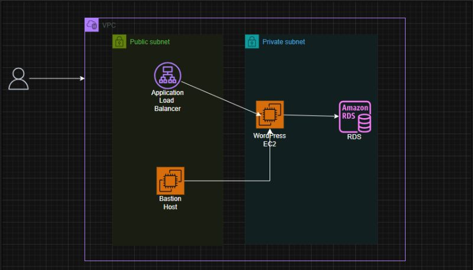

# Terraform Advanced WordPress Deployment

This project demonstrates how I deployed a secure, scalable WordPress environment on AWS using a multi-tier architecture. The setup includes WordPress running on EC2, a MySQL database hosted on Amazon RDS, and an Application Load Balancer to handle web traffic.

---

## Architecture Diagram

## Architecture Summary

- **VPC:** Custom VPC with public and private subnets across two Availability Zones  
- **Public Subnets:** Hosted the Application Load Balancer and Bastion Host  
- **Private Subnets:** Contained EC2 instances running WordPress and the RDS database  
- **Internet Gateway:** Enabled inbound access to the public layer  
- **NAT Gateway:** Allowed private EC2 instances outbound internet access for updates  
- **Security Groups:** Controlled inbound/outbound rules between layers following the principle of least privilege  

---

## Deployment Steps

1. **Created a VPC** with three public and three private subnets across separate AZs  
2. **Attached an Internet Gateway** to the VPC and configured public route tables  
3. **Launched a NAT Gateway** in one public subnet for outbound access from private instances  
4. **Created Security Groups** for the ALB, Bastion Host, EC2, and RDS with precise inbound/outbound rules  
5. **Deployed RDS (MySQL)** in the private subnet and noted connection details  
6. **Launched EC2 in a private subnet with a user data script to install Apache, PHP, and WordPress  
7. **Configured an Application Load Balancer** to distribute traffic to the private EC2 instance  
